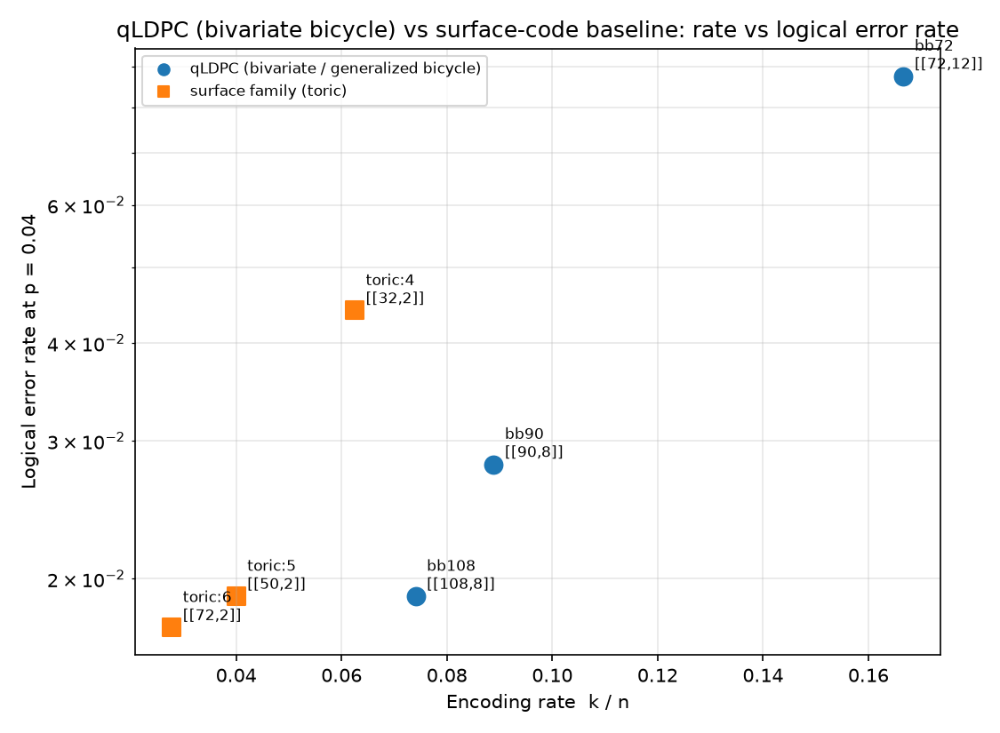
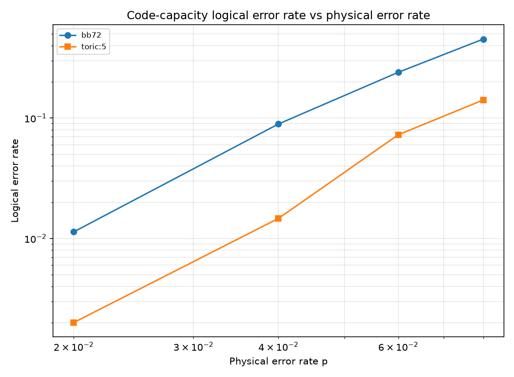

# qLDPC Builder: bivariate-bicycle codes and a from-scratch BP+OSD decoder

Construct **quantum low-density parity-check (qLDPC) codes** -- the bivariate-bicycle and
generalized-bicycle families that have moved qLDPC from theory toward hardware -- and decode them
with a **belief-propagation + ordered-statistics decoder written from scratch**. The headline study
benchmarks these high-rate codes against the surface code on the metric that matters most for
overhead: **encoding rate at a fixed logical error rate**.

This is repo 8 of a ten-part [QEC research portfolio](https://github.com/afogelis/qec-portfolio).
Where [`decoder-benchmark`](https://github.com/afogelis/decoder-benchmark) treats BP-OSD as an
optional reference on the *surface* code, here BP-OSD is the first-class decoder on the qLDPC codes
it was actually designed for.

## Results at a glance



*Code-capacity bit-flip logical error rate at p = 0.04, decoded with the from-scratch BP+OSD. The toric (surface-family) codes sit at vanishing encoding rate; the bivariate-bicycle codes reach comparable logical error rate at several times the rate. For example `bb108` [[108, 8]] matches the toric baseline's logical error rate while encoding four times as many logical qubits per physical qubit. Block logical error rate aggregates over all k logical qubits, so the high-rate `bb72` [[72, 12]] necessarily shows a higher block rate -- the rate axis is the advantage being illustrated.*



*Logical error rate versus physical error rate under the code-capacity bit-flip model for `bb72` and the distance-5 toric code.*

## What this demonstrates

- **qLDPC code construction from scratch:** bivariate-bicycle (`H_X = [A | B]`, `H_Z = [B^T | A^T]` over a 2D torus) and generalized-bicycle codes, plus a hypergraph-product toric baseline, with GF(2) computation of the logical operators and `k`.
- **A real decoder, not a wrapper:** belief propagation and order-0 ordered-statistics decoding implemented directly over GF(2). OSD always returns a syndrome-consistent correction, which plain BP does not.
- **A scientific comparison:** a code-capacity sweep showing the rate/overhead trade-off between qLDPC and surface codes.

## Decoder

The default decoder is the in-repo **BP + OSD-0**:

1. Log-domain sum-product belief propagation produces a posterior error probability per qubit.
2. If BP already explains the syndrome, its hard decision is returned.
3. Otherwise OSD-0 orders qubits most-likely-error first, selects a full-rank information set in that order by GF(2) elimination, and solves the syndrome exactly on it -- guaranteeing a valid correction.

The optional `optimized` extra installs Joschka Roffe's compiled [`ldpc`](https://github.com/quantumgizmos/ldpc)
package; `make_decoder(..., backend="auto")` then uses its faster, higher-order BP-OSD instead. The
from-scratch decoder is the default so the study reproduces on any interpreter (including those where
`ldpc` has no wheel).

## Install

```bash
pip install -e ".[dev]"
# optional compiled BP-OSD backend (Python <= 3.13):
pip install -e ".[optimized]"
```

## Quick start

```bash
pytest
python examples/build_bb_decode.py     # writes docs/{qldpc_vs_surface_rate_ler,ler_vs_p}.png
```

```bash
qldpc list
qldpc info bb72
qldpc decode bb108 --p 0.03 --shots 3000
qldpc sweep --codes bb72,bb108,toric:5 --p 0.02,0.04,0.06 --output outputs/sweep.json
```

## Library usage

```python
from qldpc import build_code, code_capacity_ler

code = build_code("bb72")          # [[72, 12]] bivariate bicycle
print(code.summary())
estimate = code_capacity_ler(code, p=0.03, shots=3000, backend="scratch")
print(estimate.logical_error_rate)
```

## Honest scope

This is a **code-capacity** study (independent bit-flip errors, perfect syndrome extraction) intended
to illustrate the qLDPC rate advantage *qualitatively*. It does **not** include circuit-level syndrome
extraction, does not claim specific distances, and does not reproduce any "under 100k physical qubits"
hardware figure -- those require a full fault-tolerant stack with a syndrome-extraction circuit and
realistic noise. The codes and decoder here are the building blocks for that, not the finished result.

## Layout

- `src/qldpc/codes/` — `bb` (bivariate bicycle), `gb` (generalized bicycle), `hgp` (toric baseline), `css` (code container)
- `src/qldpc/decoders/` — `bp` (belief propagation), `bposd` (BP+OSD-0, optional `ldpc` backend)
- `src/qldpc/linalg.py` — GF(2) rank, null space, logical operators, OSD solve
- `src/qldpc/{simulation,metrics,registry,types}.py`
- `src/qldpc/experiments/scaling.py`, `src/qldpc/viz/plots.py`
- `examples/build_bb_decode.py`

## References

- Bravyi S, Cross AW, Gambetta JM, Maslov D, Rall P, Yoder TJ. High-threshold and low-overhead fault-tolerant quantum memory. Nature 2024; 627:778-782.
- Panteleev P, Kalachev G. Degenerate quantum LDPC codes with good finite length performance. Quantum 2021; 5:585.
- Roffe J, White DR, Burton S, Campbell E. Decoding across the quantum low-density parity-check code landscape. Physical Review Research 2020; 2:043423.
- Tillich JP, Zemor G. Quantum LDPC codes with positive rate and minimum distance proportional to the square root of the block length. IEEE Transactions on Information Theory 2014; 60:1193-1202.

## License

MIT — see [LICENSE](LICENSE).
